<h1 align="center">📱 Snaply – Mobile Social Media Platform</h1>

<p align="center">
  A modern mobile-first social networking application for sharing moments, connecting with friends, and engaging in real-time conversations.
</p>

<p align="center">
  
  
  
  
  
</p>


## 📘 Project Summary

**Snaply** is a mobile-first social media application built with **React Native (Expo)**, **Firebase**, and **Cloudinary**, designed to provide a fast and engaging platform for sharing photos, connecting with friends, and interacting in real time.

Firebase handles authentication, real-time data, and user management, while **Cloudinary powers image hosting, optimization, and delivery**, ensuring fast media loading and efficient storage across devices.

Snaply focuses on **performance, scalability, and smooth mobile UX**, with a backend architecture that requires minimal server management.


---

## Download The .apk file


---

## 📸 Snaply Mobile App Screenshots

### Feed
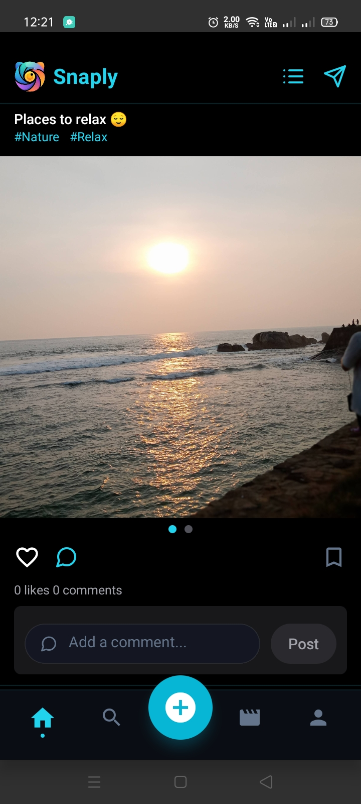
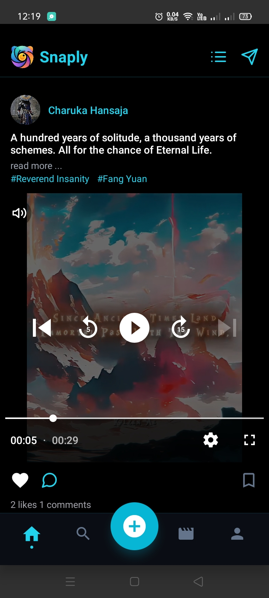

### Bookmarked
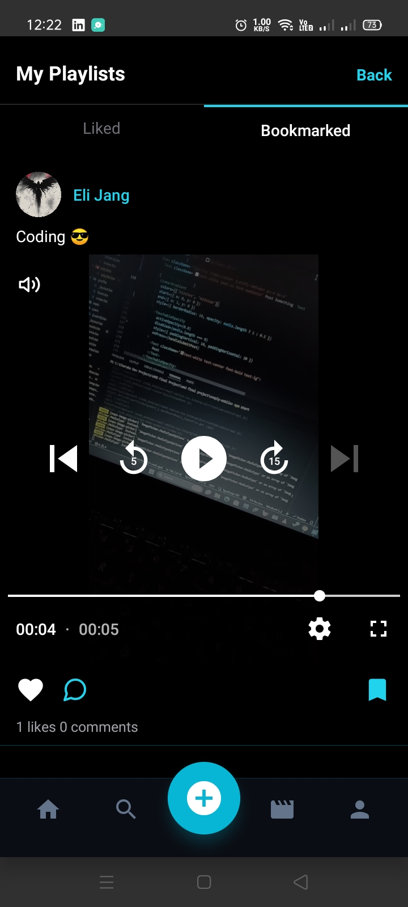

### Liked Posts
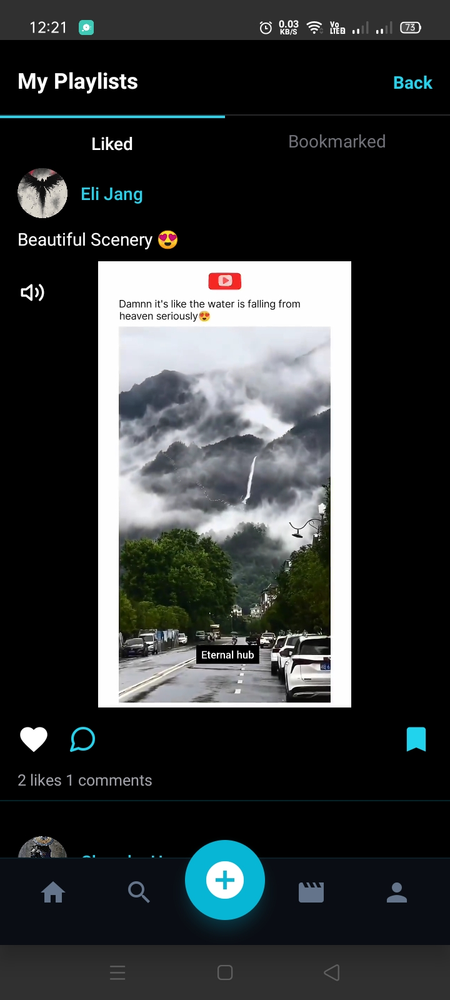

### Reels

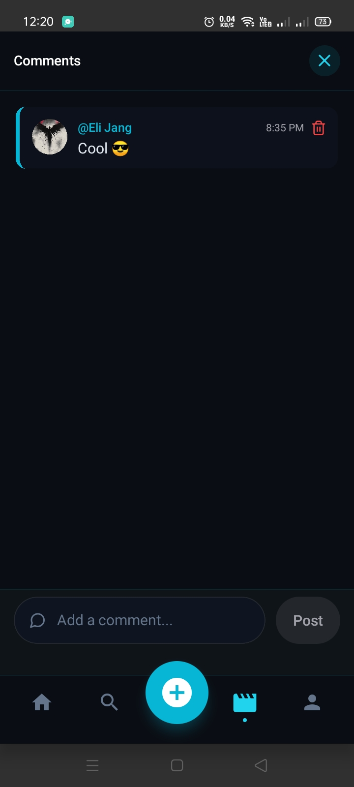

### Chat

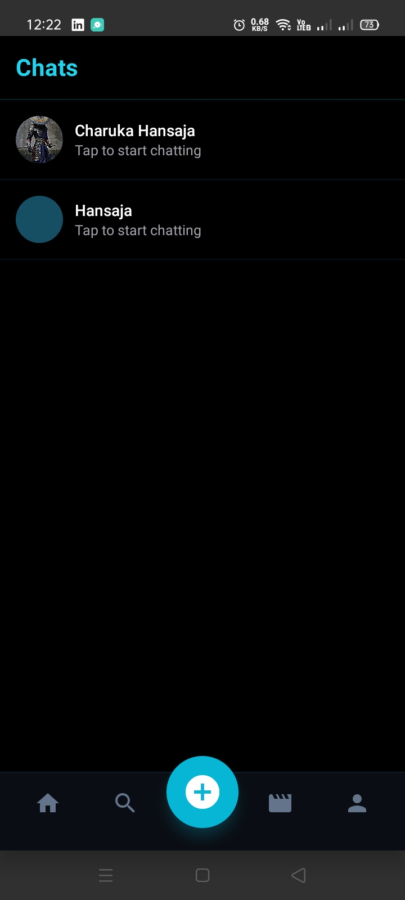

### Search
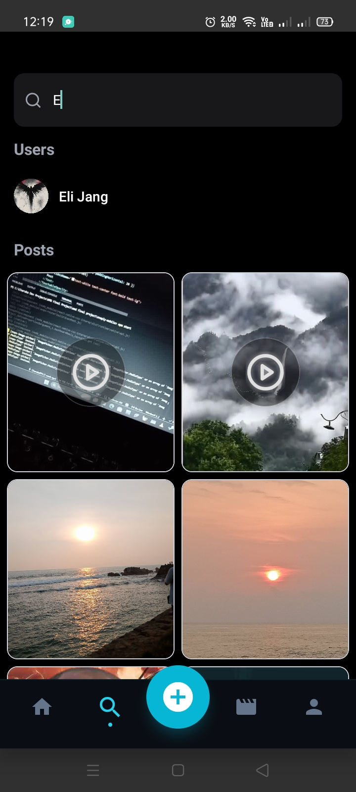

### Create Post
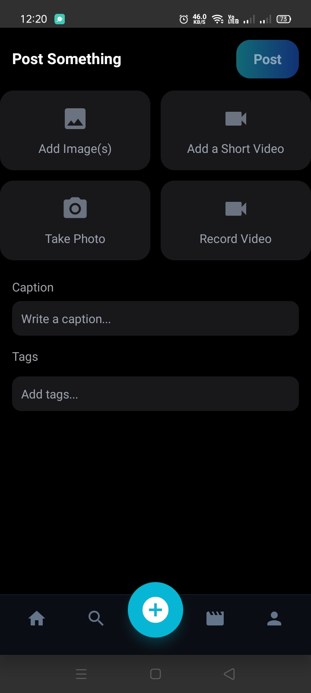

### Profile
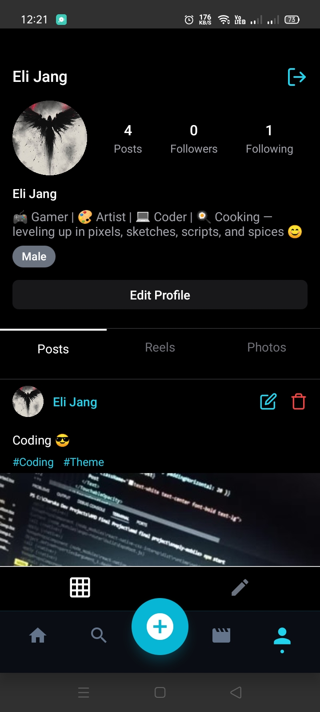

### Login
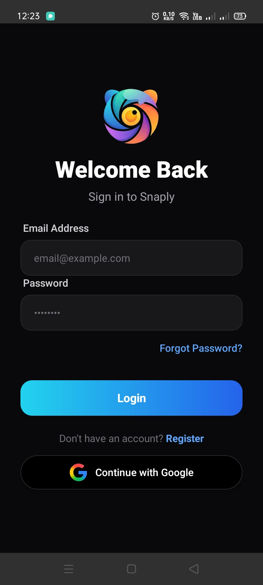

### Register
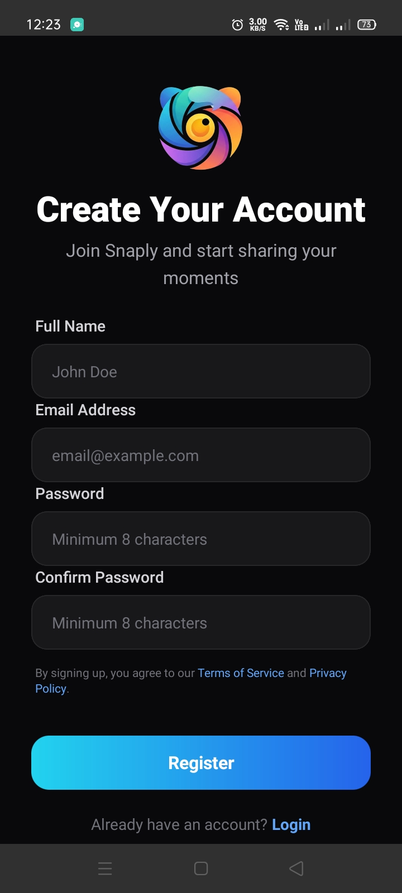


---

## 🎯 Project Objectives

- Build a fast and intuitive mobile-first social media experience  
- Enable users to share photos and engage with content in real time  
- Provide seamless user authentication and profile management  
- Encourage interaction through likes, comments, follows, and bookmarks  
- Support real-time one-to-one messaging  
- Optimize media uploads and delivery for mobile devices  
- Ensure scalability using Firebase’s serverless architecture  
- Deliver a clean, modern UI optimized for mobile UX


---

## 🧱 Core Features (MVP)

### 📰 Social Feed
- Real-time feed of user posts
- Image posts with captions and tags
- Like and comment functionality
- Bookmark posts for later viewing
- Firestore-powered real-time updates

### 🎬 Reels
- Short-form vertical video content
- Smooth scrolling reel experience
- Like and comment on reels
- Optimized video delivery for mobile devices

### 🔍 Search & Discovery
- Search users by username
- Search posts by tags and captions
- Discover trending content
- Fast, Firestore-powered querying

### 📸 Post Creation
- Upload images or videos from camera or gallery
- Add captions to posts
- Cloudinary-powered image hosting
- Optimized image delivery via CDN

### 👤 User Profiles
- User profile with avatar and bio
- View user posts
- Follow and unfollow users

### 💬 Real-Time Messaging
- One-to-one private messaging
- Real-time message updates
- Message timestamps
- Firebase Firestore-based chat system

### 🔐 Authentication & Security
- Email and password authentication
- Secure session handling
- Firebase Authentication integration
- Protected app routes


---

Gotcha 👍 — you want **this exact section rewritten for *your* app**, keeping the **same table style**, but **correct for Snaply (React Native + Expo + Firebase + Cloudinary)**.

Here’s a **drop-in replacement**. You can delete your current Tech Stack section and paste this as-is.

---

## 🧰 Tech Stack

### 📱 Frontend (Mobile App)

| Technology              | Badge                                                                                                    |
| ----------------------- | -------------------------------------------------------------------------------------------------------- |
| React Native            |            |
| Expo                    |                              |
| TypeScript              |            |
| React Navigation        |                                 |
| Context API / Redux     |     |
| NativeWind / StyleSheet |  |
| Expo Image Picker       |                 |
| Expo AV                 |                           |

---

### 🔥 Backend & Services

| Technology                            | Badge                                                                                                    |
| ------------------------------------- | -------------------------------------------------------------------------------------------------------- |
| Firebase Authentication               |             |
| Cloud Firestore                       |          |
| Firebase Security Rules               |         |
| Firebase Cloud Functions *(optional)* |           |
| Cloudinary                            |  |

---

### 🗄️ Database

| Technology      | Badge                                                                                      |
| --------------- | ------------------------------------------------------------------------------------------ |
| Cloud Firestore |  |

**Collections:**
`users`, `posts`, `comments`, `likes`, `messages`, `chat`

---

Perfect! We can **update the Tools & Platforms section** to include **VS Code** along with Expo Go. Here’s a clean, final version for your Snaply README:

---

### 🛠️ Tools & Platforms

| Tool                 | Badge                                                                                                        |
| -------------------- | ------------------------------------------------------------------------------------------------------------ |
| VS Code              |              |
| Git                  |                                     |
| GitHub               |                            |
| Expo Go              |                               |
| Firebase Console     |              |
| Cloudinary Dashboard |  |


---

## 🔐 System Architecture

Mobile Client (React Native + Expo)
↓
Firebase Authentication & Cloud Firestore
↓
Cloudinary (Media Uploads & Optimization)

Additional:
- Firestore real-time listeners (for feed, messages, notifications)
- Firebase Security Rules (access control)
- Expo AV / Video (for Reels)
- Cloudinary CDN (optimized media delivery)


```markdown

## 🗂️ Folder Structure

snaply-mobile/
├── .expo/                       # Expo internal files
├── .github/                      # GitHub workflows / actions
├── .vscode/                      # VS Code settings
├── app/                          # Main app code
│   ├── auth/                     # Authentication screens/components
│   ├── dashboard/                # Dashboard screens/components
│   ├── _layout.tsx               # Layout wrapper
│   ├── getstarted.tsx            # Onboarding / get started screen
│   └── index.tsx                 # App entry / main screen
├── assets/                       # Images, fonts, icons
├── components/                   # Reusable UI components
├── constants/                    # App constants (colors, strings, etc.)
├── context/                      # Context API / Redux setup
├── hooks/                        # Custom React hooks
├── node_modules/                 # Node dependencies
├── prt-sc-images/                # Screenshots / mock images
├── scripts/                      # Utility scripts
├── services/                     # Firebase, Cloudinary, and API services
├── .env                          # Environment variables
├── .gitignore                     # Git ignore file
├── app.json                       # Expo config
├── babel.config.js                # Babel configuration
├── eslint.config.js               # ESLint configuration
├── expo-env.d.ts                  # Expo environment TypeScript declarations
├── global.css                     # Global styles
├── images.d.ts                    # Type declarations for images
├── LICENSE                        # License file
├── metro.config.js                # Metro bundler config
├── nativewind-env.d.ts            # NativeWind TypeScript declarations
├── package-lock.json              # Package lock file
├── package.json                   # Project dependencies
├── README.md                      # Project README
├── tailwind.config.js             # Tailwind / NativeWind config
└── tsconfig.json                  # TypeScript configuration


---

## 📅 Development Timeline

**Core MVP**

1. Firebase Authentication setup
2. Cloud Firestore database design
3. User profile screens + UI skeleton
4. Social Feed with posts, likes, comments, bookmarks
5. Reels (short videos) implementation using Expo AV + Cloudinary
6. Real-time messaging with Firestore listeners
7. Notifications for likes, comments, follows

**Future / Production Enhancements**

* Push notifications
* Stories feature
* Theme UI refinements
* Content search & discovery improvements
* Performance optimizations for media-heavy feeds

---

## 🧪 Testing Strategy

* Mobile UI responsiveness across devices
* Firebase Authentication & Firestore CRUD verification
* Reels video playback & Cloudinary media optimization tests
* Real-time chat functionality testing
* Expo build & release testing on Android / iOS

---

## 🚀 Deployment

| Component          | Platform                                  |
| ------------------ | ----------------------------------------- |
| Mobile App         | Expo / Android & iOS                      |
| Backend / Database | Firebase Authentication & Cloud Firestore |
| Media Storage      | Cloudinary CDN                            |
| Testing & Builds   | Expo Go / Expo Application Services       |

---

## 💼 How to Run Locally

### Install dependencies & start Expo

```bash
npm install
npx expo start
```

### Environment Variables (.env)

```env
# Firebase
EXPO_PUBLIC_FIREBASE_API_KEY=your_api_key
EXPO_PUBLIC_FIREBASE_AUTH_DOMAIN=your_auth_domain
EXPO_PUBLIC_FIREBASE_PROJECT_ID=your_project_id
EXPO_PUBLIC_FIREBASE_STORAGE_BUCKET=your_storage_bucket
EXPO_PUBLIC_FIREBASE_MESSAGING_SENDER_ID=your_sender_id
EXPO_PUBLIC_FIREBASE_APP_ID=your_app_id

# Cloudinary
EXPO_PUBLIC_CLOUDINARY_CLOUD_NAME=your_cloud_name
EXPO_PUBLIC_CLOUDINARY_UPLOAD_PRESET=your_upload_preset
```

---

## 💼 Final Deliverables

* Fully functional **mobile social media app**
* Real-time **feed, Reels, and messaging**
* **Firebase backend + Cloudinary media integration**
* Cross-platform mobile deployment via **Expo**
* GitHub repository with complete documentation
* Screenshots / demo-ready mobile UI

---


## 🌟 Author

Charuka Dev
Full-stack Developer
Focused on SaaS, AI, and cloud-based solutions

---

## 👥 Contributors

U. G. Charuka Hansaja – Full-stack Developer

---

## 📄 License

This project is licensed under the MIT License.
You are free to use, modify, and distribute this software with attribution.

See the [LICENSE](./LICENSE) file for details.

---
